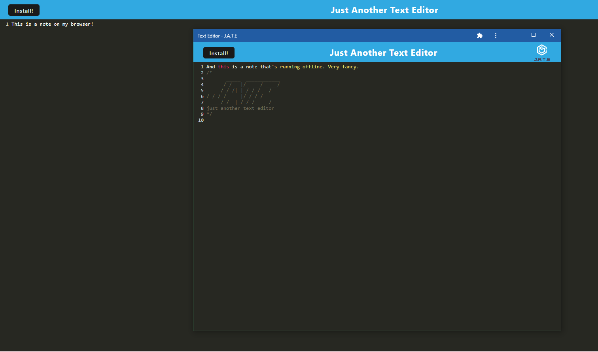

# Text Editor 

## Description 
This application will allow you to take notes from anywhere, with or without internet access. Now you'll never be in a situation where you're offline and unable to take notes on your device.

## Installation

From the command line: 
- npm install
- npm run build
- npm start 
- From here, go to your local port and the application will be running for you. 

## Usage

## Credits 
N/A

## Questions
Any questions about this project? You can reach me here:
* Email: amsudekum@gmail.com
* GitHub: amsudekum https://github.com/amsudekum
